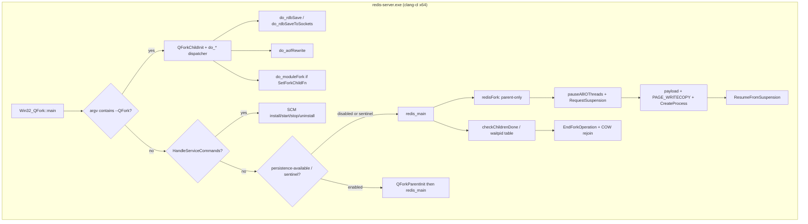
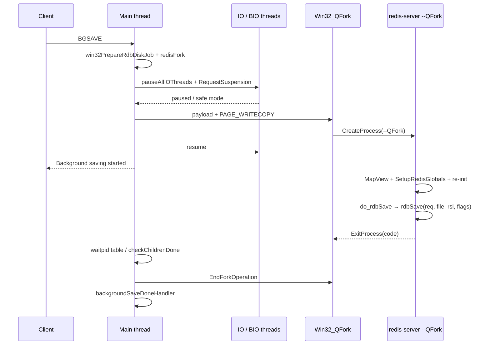

# Native Redis 8.10 for Windows

| Field | Value |
|-------|--------|
| **Title** | Native Redis Open Source 8.10.0 for Windows x64 |
| **Author** | Grok (design-doc-writer) for Tomasz Poradowski |
| **Date** | 2026-08-14 |
| **Revised** | 2026-08-14 (open questions locked) |
| **Status** | Approved |
| **Product** | Continuation of [tporadowski/redis](https://github.com/tporadowski/redis) (star count ~10.2k is **external, not re-verified** from this workspace) |
| **Upstream** | Redis Open Source 8.10.0 (`REDIS_VERSION "8.10.0"`, `REDIS_VERSION_NUM 0x00080a00`) |
| **Reference port** | tporadowski Redis 5.0.14.1 (`REDIS_VERSION "5.0.14.1"`) — compatibility foundation only |

This document is a licensing *plan* and an engineering plan. It is not legal advice.

---

## Overview

[tporadowski/redis](https://github.com/tporadowski/redis) is the unofficial native Windows port of Redis. The current stable line is Redis 5.0.14.1 (`win-5.0`), itself a continuation of MSOpenTech `win-3.2.100` through tporadowski `win-4.0.14`. Official Redis 8.10.0 has no Windows port. A Cygwin-based competitor ([redis-windows/redis-windows](https://github.com/redis-windows/redis-windows)) is described on that project as “local development only” and as depending on `cygwin1.dll` plus a .NET service wrapper (**external claim, not re-verified** from this workspace).

This program produces **native Redis Open Source 8.10.0 for Windows x64** and ships it from the same GitHub repository. Differentiator versus Cygwin, and versus a forkless-only port: native Win32, IOCP, QFork copy-on-write persistence, a real Windows Service, Windows paths, and no `cygwin1.dll`.

The engineering strategy is locked: **start from official Redis 8.10.0 and lift/modernize `Win32_Interop` from 5.0.14.1**. Do not merge six years of Redis into the 5.0 tree.

**“Confine Windows” applies to algorithms and new persistence APIs, not to every line that must compile.** Windows-specific *behavior* lives in `src/Win32_Interop/`, jemalloc `pages.c` hooks, one `ae` backend, service/Event Log, and a child dispatcher. Compile-time reality is broader: POSIX wrapper headers, a handful of LLP64 site fixes (`sizeof(long)`, `clzl`), and thin `#ifdef _WIN32` at the 8.10 fork call sites (`rdb.c`, `aof.c`, `module.c`, `eval.c`) so the parent does not pretend `CreateProcess` returned 0 on the caller’s stack. Do **not** introduce `PORT_LONG` / `PORT_LONGLONG` aliases.

---

## Background & Motivation

### Historical line

| Era | Tree / tag | License | Notes |
|-----|------------|---------|--------|
| MSOpenTech | `win-3.2.100` | BSD-3-Clause | Original native port: IOCP, QFork, Windows Service |
| tporadowski | `win-4.0.14` | BSD-3-Clause | Preserved; do not overwrite |
| tporadowski | `win-5.0` / `v5.0.14.1` | BSD-3-Clause | Current product on GitHub; still supported |
| This program | `win-8.10` / `v8.10.0-win.N` | Redis 8 tri-license | New native line |

(`develop` as the live default branch of `tporadowski/redis` is **external, not re-verified** from this workspace. Local 5.0 README presents 5.0.14 as the product. Do not force-push `develop` or `win-5.0` regardless.)

### Current state and pain points

1. **Redis 8 is six major versions ahead of the Windows port.** 8.10 introduced (relative to 5.0) ACL, Functions, TLS as a first-class `ConnectionType`, IO threads with N `aeEventLoop`s, Multi-Part AOF, `BACKUP`, cluster refactor (`cluster.c` / `cluster_legacy.c` / `cluster_asm.c`), vector-sets, and a unified `redisFork()` / `checkChildrenDone()` child model. The 5.0 tree cannot absorb this by incremental merge.

2. **5.0 QFork APIs are scattered and size-capped.** `rdb.c` and `aof.c` call `BeginForkOperation_Rdb` / `BeginForkOperation_Aof` directly and pass `&server, sizeof(server)`. The control block embeds `BYTE redisData[MAX_REDIS_DATA_SIZE]` with `MAX_REDIS_DATA_SIZE 10000` (`tporadowski_redis/src/Win32_Interop/Win32_QFork.cpp:143`; throw at `:530`). Redis 8 `struct redisServer` (`server.h:2041–2705`) is hundreds of members and far larger than 10 KB.

3. **5.0 IOCP is one-loop.** `WSIOCP_Init` stores a **process-global** `iocph` (`win32_wsiocp.c:486–489`). Redis 8.10 creates one event loop on the main thread (`server.c:3084`) and one per IO thread (`iothread.c:1006`, up to `IO_THREADS_MAX_NUM` 128). A global IOCP cannot attach sockets that migrate via `unbind_event_loop` / `rebind_event_loop`.

4. **5.0 pthreads cannot wake all waiters and cannot join.** `pthread_cond_broadcast` is a stub that returns 0 (`Win32_PThread.c:211–214`). `pthread_join` is not exported; `pthread_create` closes the `_beginthreadex` HANDLE (`Win32_PThread.c:56`). Redis 8 BIO/IO/debug all `pthread_join` after `pthread_cancel`.

5. **Users who want Redis 8 on Windows today have only Cygwin.** That is not a production native port.

Local trees used as source of truth for this document:

- `D:\xAI\redis\redis_redis` — official Redis 8.10.0. No Windows port.
- `D:\xAI\redis\tporadowski_redis` — native Windows port of 5.0.14.1. Reference only; do not evolve this tree forward.

---

## Goals & Non-Goals

### Goals

- Ship **native** `redis-server.exe`, `redis-cli.exe`, `redis-benchmark.exe`, `redis-check-rdb.exe`, `redis-check-aof.exe` for **Windows x64** only.
- Full core parity with Redis 8.10.0 except bundled Rust modules **and except faithful `RedisModule_Fork` stack continuation** (see Key Decision 26):
  - TCP, AF_UNIX, TLS
  - ACL, Functions
  - In-tree vector-sets (`modules/vector-sets/`, `INCLUDE_VEC_SETS=1`)
  - Modules API: `LoadLibrary` `.dll`, `RedisModule_*` alloc/call, hello-world modules. **`RedisModule_Fork` is unsupported at GA** unless the module registers `RedisModule_SetForkChildFn`
  - IO threads (upstream default is already 1; do not recommend `>1` until M9 is proven)
  - Cluster + Sentinel
  - Multi-Part AOF + `BACKUP`
  - Windows Service + Event Log
- Real BGSAVE / BGREWRITEAOF via QFork from day one, wired through parent-only `redisFork()` + a child dispatcher (modernized `Win32_QFork_impl.c`).
- clang-cl + CMake, VS 2022 Windows SDK.
- Release from [tporadowski/redis](https://github.com/tporadowski/redis) on a new `win-8.10` branch without overwriting the BSD 5.0/4.0 lines.

### Non-Goals

| Item | Reason |
|------|--------|
| 32-bit | QFork heap math and jemalloc `LG_PAGE=22` are x64-only in practice; 5.0 x86 was a 1 GB cap |
| Bundled Rust modules (RediSearch, RedisJSON, RedisTimeSeries, RedisBloom) | Next program; listed in `modules/modules.yaml` but not in-tree C |
| Faithful `RedisModule_Fork` stack continuation | `CreateProcess` cannot return 0 into the module. GA contract: error, or registered `SetForkChildFn` |
| systemd / `setproctitle` / THP / Linux OOM score | Linux-only; `setOOMScoreAdj` in `redisFork` becomes a no-op |
| Field-for-field `/proc` INFO | Windows has no `/proc`; report what `GetProcessMemoryInfo` / `GlobalMemoryStatusEx` can give |
| Faithful `madvise` CoW accounting | QFork approximates COW via `PAGE_WRITECOPY` + pagefile |
| Stock MSVC as the compiler | clang-cl only (MSVC STL/SDK, LLVM frontend) |
| Mixing 8.10 sources into `win-5.0` | Would contaminate the BSD line |
| Cygwin / MSYS2 / MinGW runtime | Destroys the native differentiator |
| Forkless-only persistence | Rejects the product intent |
| `daemonize yes` as a real fork | Documented no-op; use Windows Service |

Minimum OS: **Windows 10 version 1803 / Windows Server 2019** (AF_UNIX via `afunix.sys` — **external platform claim**, documented by Microsoft; not re-tested in this workspace). Document this on the README and in `Redis on Windows.md`. TCP-only operation on older Windows is not a goal.

---

## Repo / Release Strategy

### Current GitHub layout (do not destroy)

| Ref | Role | License |
|-----|------|---------|
| `develop` | 5.0-era working tree (reported default; **not live-checked**) | BSD-3-Clause (`COPYING`) |
| `win-5.0` | Stable 5.0.14.1 | BSD-3-Clause |
| `win-4.0.14` | Stable 4.0.14 | BSD-3-Clause |
| tags `v5.0.14`, `v5.0.14.1` | Historical releases | BSD-3-Clause |

**Do not overwrite, force-push, or rewrite** `win-5.0`, `win-4.0.14`, `develop`, or historical tags. 5.0.14.1 remains the supported BSD Redis 5 line for users who cannot or will not take the Redis 8 tri-license.

### First Monday — git / license checklist

Push rights to `tporadowski/redis` and `tporadowski/jemalloc` are assumed to be Tomasz Poradowski’s; not verifiable from this workspace.

```bat
:: from a clone of github.com/tporadowski/redis
git remote add redis https://github.com/redis/redis.git
git fetch redis tag 8.10.0
git checkout -b win-8.10 8.10.0
:: NEVER: git checkout win-5.0 && git merge 8.10.0
:: NEVER: git push --force origin win-5.0 develop win-4.0.14
```

Then, on `win-8.10` only:

1. Confirm `LICENSE.txt` and `REDISCONTRIBUTIONS.txt` are the official 8.10 copies (they arrive with the tag).
2. Do **not** copy 5.0 `COPYING` onto `win-8.10`. Leave `COPYING` untouched on `win-5.0`.
3. New Windows files: `SPDX-License-Identifier: RSALv2 OR SSPLv1 OR AGPLv3`.
4. Lifted MSOpenTech / tporadowski files: keep the existing BSD copyright headers.
5. Add a one-line `NOTICE` or README “Modified version of Redis Open Source 8.10.0”.
6. Do **not** invent a Redis Ltd CLA requirement for this unofficial port. New Windows commits are contributions to tporadowski/redis. Upstream `CONTRIBUTING.md` / Software Grant applies only if/when a patch is sent to Redis Ltd.

After first GA, keep 5.0 discoverable:

- GitHub Releases: retain `v5.0.14.1` assets; new assets named `Redis-x64-8.10.0-win.N.zip`.
- Wiki / landing blurb: “Need BSD Redis 5? Use tag `v5.0.14.1` / branch `win-5.0`.”
- Do not delete the 5.0 wiki pages; add an 8.10 page alongside.

### New line

1. Create branch **`win-8.10`** from official `redis/redis` tag `8.10.0` (fetch + branch, **not** a merge into any 5.0 branch).
2. Add the Windows layer on top of that import. Never merge 8.10 sources into `win-5.0`.
3. Keep `develop` as-is until the first 8.10 Windows GA.
4. **At first 8.10 Windows GA** (`v8.10.0-win.1`), switch the GitHub default branch to `win-8.10` so the landing page matches the new product.

### Tags

| Tag | Meaning |
|-----|---------|
| `v8.10.0-win.1` | First Windows release of upstream 8.10.0 |
| `v8.10.0-win.2` | Windows-only fix on the same upstream |
| `v8.10.x-win.N` | When tracking a newer official 8.10.x patch |

Pattern: upstream version + `-win.` + port revision. Do not reuse bare `v8.10.0` (that tag belongs to Redis Ltd. upstream).

### README must tell both stories

1. **Redis 8.10 for Windows** is the new native line (`win-8.10`, tri-licensed, unofficial).
2. **Redis 5.0.14.1 for Windows** remains available on `win-5.0` / tag `v5.0.14.1` for users who need BSD Redis 5.
3. This is an **unofficial port, not affiliated with Redis Ltd.**
4. Trademark: keep the RSALv2 notice that “any use of Licensor's Trademarks is subject to applicable law.” Do not imply Redis Ltd endorsement. Do not use Redis Ltd logos.

### Docs to revive / update (from the 5.0 tree)

| File | Action |
|------|--------|
| `Redis on Windows.md` | Rewrite for 8.10: QFork, pagefile, ASLR, `maxmemory`/`maxheap`, AF_UNIX, TLS, IO threads, `RedisModule_Fork` Windows contract, `daemonize` no-op |
| `Windows Service Documentation.md` | Keep `--service-install` / `--service-start` / `--service-stop` / `--service-uninstall` / `--service-name` CLI. MSI notes stay historical (5.0); MSI is out of scope for this program. |
| `Redis on Windows Release Notes.md` | New 8.10 section |
| `redis.windows.conf` / `redis.windows-service.conf` | Revive from `msvs/setups/documentation/`; add 8.10 keys (ACL, TLS, `backupdirname`, `unixsocket`). Leave `io-threads` at upstream default 1; do not recommend `>1` until M9. |

### jemalloc patch source

**Decision: continue [tporadowski/jemalloc](https://github.com/tporadowski/jemalloc) as the patch source; copy the result into `deps/jemalloc`.**

The live GitHub contents of `tporadowski/jemalloc` were **not re-verified** from this workspace. Local 5.0 vendors jemalloc **5.2.1** with `USE_WIN32_EXTERNAL_HEAP_ALLOC`. Official 8.10 vendors **5.3.0-0-g0**. **3.1 rebased the 5.2.1 page hooks onto the Redis-vendored 5.3 tree** (did not replace Redis jemalloc; kept `JEMALLOC_FRAG_HINT` / `JEMALLOC_ALLOC_WITH_USIZE` / `je_get_defrag_hint`). `os_pages_commit` calls new `CommitHeapBlock` (not `AllocHeapBlock`). Windows CMake headers are checked in (`JEMALLOC_RETAIN` undefined, `LG_PAGE=22`, `JEMALLOC_NO_PRIVATE_NAMESPACE`). `je_malloc_conf` is `extern` in jemalloc on Windows (no weak symbols; Redis `zmalloc.c` defines it). Push the same `pages.c`/`pages.h` + Windows headers to tporadowski/jemalloc when that repo is next updated.

---

## License

**This section is a licensing plan, not legal advice.** Recipients and redistributors must make their own license choice and obtain counsel if needed.

### Upstream Redis 8.10

`redis_redis/LICENSE.txt` states that starting with Redis 8, Redis Open Source is **tri-licensed**: RSALv2 **or** SSPLv1 **or** AGPLv3. Redis 7.2 and prior remain BSD-3-Clause, referenced by `REDISCONTRIBUTIONS.txt`.

RSALv2 §Limitations (LICENSE.txt:81–96) restricts making the functionality available to third parties as a service and includes language about distributing a Modified version “in a manner that makes the functionality of the Software available to third parties.” Official Redis Ltd also ships binaries under the same tri-license. **This port does not claim that RSALv2 forbids distributing `redis-server.exe`.** That reading is counsel’s job. The engineering plan is: **do not pick RSALv2 as the sole outbound license.** Inherit the same tri-license as official Redis 8.10 so recipients choose AGPLv3 / SSPL / RSAL themselves.

RSALv2 / SSPL / AGPL all require prominent “Modified” notices. The port is unambiguously a Modified version.

### What to ship in the tree

| File | Action |
|------|--------|
| `LICENSE.txt` | Keep the official 8.10.0 file; do not rewrite |
| `REDISCONTRIBUTIONS.txt` | Keep the official 8.10.0 file |
| `COPYING` | Do **not** carry the 5.0 BSD `COPYING` as the 8.10 project license. Historical BSD `COPYING` stays on `win-5.0` / `win-4.0.14` |
| `license.txt` (5.0 MSOpenTech + tporadowski BSD) | Do not use as the 8.10 project license |

Windows-original files (new CMake, new `ae_wsiocp.c`, QFork modernization, POSIX wrappers) carry:

```
SPDX-License-Identifier: RSALv2 OR SSPLv1 OR AGPLv3
```

Lifted MSOpenTech / tporadowski files retain the existing BSD copyright headers. The combined work on `win-8.10` is offered under the Redis 8 tri-license. **Do not mix 8.10 sources into `win-5.0`.**

### README license blurb (required)

- Redis 8.10 for Windows is a Modified version of Redis Open Source 8.10.0.
- It is offered under the same tri-license as upstream (RSALv2 or SSPLv1 or AGPLv3). Recipients choose.
- Redis 5.0.14.1 for Windows remains BSD-3-Clause on `win-5.0`.
- Unofficial port, not affiliated with Redis Ltd.
- This is not legal advice.

---

## Proposed Design

### Architecture

```
redis-server.exe (clang-cl, x64, RandomizedBaseAddress=NO)
  Win32_QFork::main          // service cmds, heap, --QFork child dispatcher, then redis_main
    ParseCommandLineArguments
    SetupQForkGlobals        // persistence-available, sentinel, --QFork
    SetupLogging             // Event Log if service or syslog-enabled
    HandleServiceCommands    // --service-install/start/stop/uninstall/name
    QForkStartup             // parent: reserve pagefile heap
                             // child: map COW + dispatch do_* (NEVER redis_main)
    redis_main               // parent only; #define main redis_main
      initServerConfig / ACLInit / moduleInitModulesSystem
      connTypeInitialize()   // TCP + Unix type required (listen may be later)
      redisFork()            // PARENT-ONLY on Windows; never returns 0
      checkChildrenDone()    // waitpid over the Win32 process table
        ae_wsiocp            // ONE IOCP PER aeEventLoop; delay-associate SOCKET
        FDAPI + RFDMap
        ConnectionType: tcp + unix + tls
        Win32_PThread        // cond signal+broadcast, pthread_join; no pthread_cancel
        jemalloc 5.3         // pages.c map vs commit-in-place
        Event Log + Windows Service
```



### Confine Windows (behavior vs compile)

Windows-specific **behavior** is allowed in:

| Location | Role |
|----------|------|
| `src/Win32_Interop/` | Entire modernized interop library, POSIX wrappers, process table |
| `src/Win32_Interop/posix/` | Wrapper headers so `server.h` compiles (see Appendix A) |
| `src/config.h`, `src/fmacros.h`, `src/server.h` | Include guards, `off_t`, `arch_bits` |
| `src/server.c` `redisFork()` | Parent-only Windows path; `daemonize()` no-op; `arch_bits` |
| `src/rdb.c`, `src/aof.c`, `src/module.c`, `src/eval.c` | Thin `#ifdef _WIN32` at fork sites: parent captures payload args, child branch is not compiled or is `serverPanic` |
| `src/ae.c` include chain | `#ifdef _WIN32` → `ae_wsiocp.c` (same pattern as 5.0 `ae.c:59–60`; 8.10 `ae.c` has no such guard yet) |
| `src/ae_wsiocp.c` | New N-loop IOCP backend |
| `deps/jemalloc/src/pages.c`, `include/jemalloc/internal/pages.h` | Ported `USE_WIN32_EXTERNAL_HEAP_ALLOC` hooks |
| `src/anet.c` | Skip `SO_REUSEADDR` on `AF_UNIX`; WSA errno maps |
| `src/tls.c` | VLA → heap buffer; includes |
| `src/config.c` | `createBoolConfig("persistence-available", ...)` |
| `src/sentinel.c` | Lift 5.0 `CreateProcessA` script path; register pids in the waitpid table |
| Service / Event Log / installer / CMake | New files |
| Many `src/*.c` | Only the LLP64 sites that are actually wrong (`sizeof(long)`, `clzl`) — not a type rename |

**Honest rule:** do not invent a second persistence API (`BeginForkOperation_*` called from `rdb.c`). Do **not** claim the four fork files stay byte-identical. “Confine Windows” = no Windows algorithms in eviction, cluster state machines, ACL, Functions. Type-width edits and the four fork-site `#ifdef`s are in scope.

### Three required design fixes versus 5.0

#### 1. QFork is parent-only; child is a dispatcher — not `fork()` on the caller’s stack

Official 8.10 (`server.c:7484`) `fork()` returns 0 in the child and execution **continues in the caller** (`rdbSaveBackground`, `rdbSaveToSlavesSockets`, `rewriteAppendOnlyFileBackground`, `RM_Fork`, `eval.c` LDB).

`CreateProcess` starts a new image at `Win32_QFork::main`. **`win32RedisFork()` / Windows `redisFork()` never returns 0.** Every `if ((childpid = redisFork(...)) == 0)` block is dead in the child.

5.0 already solved this by *not* pretending to be `fork()`: the child dispatched to `do_rdbSave` / `do_aofSave` / `do_socketSave` from `Win32_QFork.cpp` (~297–325) and `Win32_QFork_impl.c`. Those helpers exist because the caller’s child branch never runs.

**Locked child model:**

1. On Windows, `redisFork(purpose)` is **parent-only**. It freezes threads, fills the QFork payload (including per-purpose args the parent just captured), `CreateProcess`s `--QFork`, resumes threads, registers the child in the process table, and returns the Windows pid (or -1).
2. The child never enters `redis_main`. `QForkStartup` sees `--QFork`, maps the COW heap, `SetupRedisGlobals`, then `QForkChildDispatch(purpose)` in a modernized `Win32_QFork_impl.c`.
3. Each 8.10 child branch is reimplemented as a `do_*` helper that calls the same Redis functions the Linux child would have called (`rdbSave`, `rdbSaveRioWithEOFMark`, `rewriteAppendOnlyFile`, …).
4. Call sites get a **thin** `#ifdef _WIN32`: before `redisFork`, write locals into `server.qfork_job` (or a dedicated `win32PrepareForkJob_*`); after a successful parent return, do the existing parent-only bookkeeping. The `childpid == 0` block is `#ifndef _WIN32`.

```c
#ifdef _WIN32
    win32PrepareRdbDiskJob(req, filename, rsi, rdbflags);
#endif
    if ((childpid = redisFork(CHILD_TYPE_RDB)) == 0) {
#ifndef _WIN32
        /* Linux child — unchanged */
        retval = rdbSave(req, filename, rsi, rdbflags);
        ...
#endif
    } else {
        /* parent — shared */
    }
```

Alternatively the Windows parent path can skip the `== 0` check entirely and only run the `else` (cleaner; same effect).

##### 8.10 child sites and payload fields

| Site | Linux child does | Windows `do_*` | Payload fields (not inside `server`) |
|------|------------------|----------------|--------------------------------------|
| `rdb.c:2232` `rdbSaveBackground` | `rdbSave(req, filename, rsi, rdbflags)` then `sendChildCowInfo` / `exitFromChild` | `do_rdbSave` | `req` (`int`), `filename[MAX_PATH]`, `rdbSaveInfo rsi` (by value), `rdbflags` |
| `rdb.c:5344` `rdbSaveToSlavesSockets` | `rioInitWithConnset` **or** `rioInitWithFd` + `rdbSaveRioWithEOFMark` / `slotSnapshotSaveRio`; pipes `rdb_pipe_write`, `safe_to_exit_pipe`; `SLAVE_REQ_*` flags | `do_rdbSaveToSockets` | `req`, `rsi`, `rdb_channel`, `slots_req`, `numconns`, duplicated SOCKETs via `WSADuplicateSocket` + `WSAPROTOCOL_INFO[]` (rdb-channel) **or** pipe HANDLEs `rdb_pipe_write` + `safe_to_exit` (legacy pipe path) |
| `aof.c:3239` `rewriteAppendOnlyFileBackground` | `snprintf(tmpfile, …, "temp-rewriteaof-bg-%d.aof", getpid())`, `rewriteAppendOnlyFile(tmpfile)`, `sendChildCowInfo` | `do_aofRewrite` | **No 5.0 `aof_pipe_*`.** 8.10 MP-AOF has no incremental-diff pipes (grep `aof_pipe_` in official `src/` is empty). Child builds `temp-rewriteaof-bg-<child_pid>.aof` from `getpid()`; parent later finds that name. Payload: `child_info_write` + `server` snapshot only. |
| `module.c:12498` `RM_Fork` | returns 0 into the **module** | `do_moduleFork` only if a child fn was registered | see §RedisModule_Fork contract — **not** a stack continuation |
| `eval.c:870` LDB | Lua debugger child | **not implemented** | LDB is SYNC-only on Windows (Key Decision 27) |
| `syscheck.c:255` CoW probe | Linux-only | no-op | — |

Also always in the payload header: `magic`, `purpose`, `sizeof(server)`, `dictHashSeed[16]`, duplicated `child_info_pipe` write HANDLE, parent pid.

`rdbSave` signature to call from `do_rdbSave` is 8.10 `int rdbSave(int req, char *filename, rdbSaveInfo *rsi, int rdbflags)` (`rdb.h:162`) — **not** 5.0 `rdbSave(filename, rsiptr)`.

##### `struct redisServer` after memcpy — trust vs re-init

`SetupRedisGlobals` still `memcpy(&server, redisData, redisDataSize)` and `dictSetHashFunctionSeed`. Then the child **must** fix fields that are not valid in a new process:

| Class | Examples | Child action |
|-------|----------|--------------|
| **Trust** (pointers into the COW jemalloc map at the same VA) | `server.db`, keyspace dicts, objects, module type values allocated via `RedisModule_Alloc`, Functions blobs, ACL user objects if jemalloc-backed | use as-is |
| **Re-init: OS objects** | CRT `FILE*` (`server.aof_fd` as fd is an RFD — rebuild via duplicated HANDLE), raw HANDLEs not in the payload, `el` (`aeEventLoop *` — child’s loops are not the parent’s) | reset; child persistence path does not run `aeMain` |
| **Re-init: threads / sync** | `main_thread_id`, IO thread table, BIO thread ids, `pthread_mutex_t` / conds that wrap `CRITICAL_SECTION` (CS is process-local) | child is single-threaded for RDB/AOF; do not use parent mutexes. Re-init any mutex a `do_*` helper touches, or avoid them |
| **Re-init: TLS** | `SSL_CTX *` (`redis_tls_ctx`) | unused in RDB/AOF `do_*`; if ever needed, re-`tlsConfigure` |
| **Re-init: pid / child flags** | `server.pid`, `in_fork_child`, `child_pid` | set `in_fork_child = purpose`, `pid = GetCurrentProcessId()` |
| **Reload** | `server.commands` entries registered by modules | RDB/AOF: `InitRedisModulesFromConfigFile` (5.0 `Win32_QFork_impl.c:42–62`) so type callbacks exist. Do **not** use parent `modules` dict pointers into a freshly loaded `.dll` |
| **Do not trust** | `server.el`, IO-thread notifiers, client linked lists for live connections (except diskless SOCKETs passed via `WSADuplicateSocket`) | leave unused |

#### 2. Heap-allocated QFork payload (full schema)

Delete `MAX_REDIS_DATA_SIZE`. Payload is a separately mapped section:

```c
#define QFORK_MAGIC 0x51463130u /* 'QF10' */

typedef struct QForkPayloadHeader {
    uint32_t magic;
    uint32_t purpose;            /* CHILD_TYPE_* */
    uint32_t rdb_subtype;        /* 0 disk, 1 socket-pipe, 2 rdb-channel */
    size_t   redisDataSize;      /* sizeof(struct redisServer) */
    uint8_t  dictHashSeed[16];
    DWORD    parent_pid;
    HANDLE   child_info_write;   /* duplicated into child */

    /* RDB disk (rdbSaveBackground) */
    int      rdb_req;
    int      rdb_flags;
    char     filename[MAX_PATH];
    /* rdbSaveInfo follows at known offset or is embedded below */

    /* RDB socket / rdb-channel */
    int      rdb_channel;
    int      slots_req;
    int      numconns;
    HANDLE   rdb_pipe_write;
    HANDLE   safe_to_exit_pipe;
    /* WSAPROTOCOL_INFO conns[numconns] in a trailing buffer */

    /* AOF (8.10 MP-AOF): no aof_pipe_* — those 5.0 incremental-diff
     * pipes do not exist. Child builds temp-rewriteaof-bg-<pid>.aof.
     * Only child_info_write (above) + server snapshot are required. */

    /* MODULE registered child (optional stretch) */
    int      module_fork_registered; /* 1 if SetForkChildFn name was set */
} QForkPayloadHeader;

/* Immediately after header:
 *   struct redisServer server_snapshot;
 *   rdbSaveInfo rsi;
 *   WSAPROTOCOL_INFO proto[numconns];
 */
```

`win32RedisFork(int purpose)` reads `server.qfork_job` (filled by `win32Prepare*Job` at the call site). It cannot see `rdbSaveBackground`’s locals otherwise.

**HANDLE inherit (locked, same as 5.0 `CreateChildProcess` at `Win32_QFork.cpp:583`):** `CreateProcessA(..., bInheritHandles=TRUE, …)` so `child_info_write` and diskless RDB pipes inherit. Diskless **sockets** stay `CREATE_SUSPENDED` + `WSADuplicateSocket` (5.0 `:601–605`), not inherit-at-create. Do not mix the two for the same HANDLE.

#### RedisModule_Fork Windows contract (GA)

`RM_Fork` (`module.c:12495`; `redisFork` at `12498`) is not a Redis-owned child function. Modules do:

```c
if (RedisModule_Fork(cb, data) == 0) {
    /* module-owned child work */
    RedisModule_ExitFromChild(0);
}
```

QFork cannot resume that instruction pointer. Copying `server` + the COW heap does not run the module’s post-`Fork` code. Reloading the `.dll` gives fresh statics.

**At GA:**

- `RedisModule_Fork` on Windows returns `-1` and sets an error string (`"RedisModule_Fork is not supported on Windows without RedisModule_SetForkChildFn"`) **unless** the module has registered a child entry.
- Add an optional Windows-documented API, e.g. `RedisModule_SetForkChildFn(ctx, fn, user_data)`. **A raw parent function pointer is invalid in the child:** ASLR is off only on `redis-server.exe` (Decision 20); the module `.dll` may load at a different base, and a child `LoadLibrary` also invalidates the parent pointer. Stretch path (M6.3, not GA): register an **exported symbol name** (and optional `user_data` that lives in the COW heap). The QFork child `LoadLibrary`s the same module path and `GetProcAddress`s that name, then calls it. Alternative: disable ASLR on loaded module DLLs (`/DYNAMICBASE:NO` at module link). Document this in `redismodule.h` and `Redis on Windows.md`.
- This is a **Windows API difference**.
- M6 DoD is `LoadLibrary` + vector-sets + hello modules. Faithful stack-`Fork` is **out of GA**. The registered-callback path may land in M6.3 as stretch; it is not required for GA.

#### 3. One IOCP per event loop — delay associate first

5.0 `ae_wsiocp.c:75–79` creates one IOCP per `aeEventLoop`, then `WSIOCP_Init` writes a process-global `iocph`. Fatal for N loops.

**Association rule (Windows):** a SOCKET may be bound to at most one IOCP for its lifetime. You cannot re-associate.

**First attempt (locked): delay `CreateIoCompletionPort` until the connection is bound to its destination loop.**

```
accept on listen SOCKET:
  listen SOCKET is associated with the accepting loop's IOCP (main).
  accepted SOCKET is NOT associated yet (AcceptEx / accept, no CreateIoCompletionPort).
  connCreateAccepted*(el=main) — still unassociated.

when core assigns the client to a loop (main, or migrate to IO thread):
  rebind_event_loop(conn, dest_el):
    if (sockstate->iocp == NULL)
        FDAPI_SocketAttachIOCP(fd, dest_el->apidata->iocp);  // first and only associate
        WSIOCP_QueueNextRead(fd);
    else if (sockstate->iocp == dest_el->apidata->iocp)
        already home; nothing
    else
        FALLBACK: forwarding (below)
```

This matches the 8.10 model: accept on main, migrate to an IO thread **before** the first recv. The destination loop dequeues its own completions.

**Fallback if a SOCKET is already associated and the core rebinds it again:** do **not** `WSADuplicateSocket` as the first trick (new SOCKET, new fd, TLS/`SSL_set_fd` pain). Forward:

- Keep a `sockstate->owner_el` (IOCP that owns the HANDLE) and `sockstate->dest_el` (ae loop that should run `conn->read`/`write`).
- Completions dequeue on `owner_el`. That poll posts 1 byte on `dest_el`’s `eventNotifier` and stashes the `connection *` on a lock-free or mutex list (`pending_iocp_conns`).
- `dest_el` wakes, drains the list, runs the connection handlers.
- Performance: every migrated-after-associate connection costs a pipe wake on the destination. Acceptable for rare rebinds; **not** acceptable if every accepted socket stays on `IOCP_0` (that is why delay-associate is first).

**Cancel / leftover completions:**

- Before `SSL_set_fd` / `SSL_read` / `SSL_write`: `CancelIoEx` on the SOCKET, then drain that SOCKET’s completions (ignore `ERROR_OPERATION_ABORTED`) so no overlapped `WSARecv` is outstanding.
- Notifier pipe: use the existing `eventNotifier` (non-blocking). If `write` would block (pipe full), the destination loop is already runnable; skip the extra byte.
- `aeApiFree`: cancel all outstanding ops on that loop’s sockets; do **not** null a process-global IOCP.

**wepoll gate is PR 9.3** (after 9.2 IO threads + rebind). M8 TLS is single-loop first. `select` is not a production backend. **Cut-over rule (locked):** stay on IOCP unless a correctness bug in IOCP + `SSL_set_fd` + N loops is unfixed after two weeks of dedicated work post-9.2.

### waitpid / kill process table

8.10 `waitpid` sites:

| Site | What it waits for |
|------|-------------------|
| `server.c:1425` `checkChildrenDone` | QFork child (`WNOHANG`, pid == `server.child_pid`) |
| `aof.c:1251` | blocking `waitpid(-1)` after `kill(..., SIGUSR1)` |
| `module.c:12541` | blocking `waitpid(server.child_pid, ...)` |
| `sentinel.c:888` | `waitpid(-1, WNOHANG)` for **notification/reconfig scripts** (`fork`+`execve` at `sentinel.c:842`) |
| `syscheck.c:285` | Linux CoW probe — Windows no-op |

A shim that only knows `g_hForkedProcess` will miss Sentinel script pids or mis-attribute them as QFork completions.

**Win32 process table** (`src/Win32_Interop/Win32_ProcessTable.c`):

```c
typedef enum {
    WP_QFORK_CHILD,
    WP_SENTINEL_SCRIPT,
    WP_OTHER
} WinPidKind;

typedef struct WinPidEntry {
    pid_t    pid;          /* GetProcessId */
    HANDLE   process;      /* waitable */
    WinPidKind kind;
    HANDLE   abort_event;  /* QFork only: AbortForkOperation */
} WinPidEntry;

void winpid_register(pid_t pid, HANDLE process, WinPidKind kind, HANDLE abort_event);
void winpid_unregister(pid_t pid);
pid_t waitpid(pid_t pid, int *status, int options); /* -1 = any */
int   kill(pid_t pid, int sig);
```

- `waitpid(pid, …)` reaps that pid only. `WNOHANG` is `WaitForSingleObject(..., 0)`.
- Status bits emulate `WIFEXITED` / `WEXITSTATUS` / `WIFSIGNALED` / `WTERMSIG`.
- `kill(pid, SIGUSR1)` on a QFork child → `SetEvent(abort_event)` / `AbortForkOperation` (5.0). The child checks the event and `exitFromChild` with the no-error/killed convention Redis already uses (`SERVER_CHILD_NOERROR_RETVAL` / SIGUSR1 mapping in `checkChildrenDone`).
- `kill` on a Sentinel script → `TerminateProcess` (5.0).
- **Locked `waitpid(-1)` rule:** do **not** implement a generic “reap any” `waitpid(-1)` that can consume a Sentinel script zombie before Sentinel sees it. On Windows:
  - `checkChildrenDone` and `killAppendOnlyChild` call **`waitpid(server.child_pid, …)`** (QFork child only).
  - Sentinel `sentinelCollectTerminatedScripts` calls **`waitpid(-1)` that iterates only `WP_SENTINEL_SCRIPT`** (or keeps the 5.0 `WaitForSingleObject(sj->hScriptProcess)` loop). M7 lifts 5.0 `CreateProcessA` (`sentinel.c:861–876`) and `winpid_register`s script pids as `WP_SENTINEL_SCRIPT`.
- Delete any “reaps any; callers compare pid” implementation — `waitpid` consumes the zombie.

### persistence-available (8.10 config system)

Do **not** paste 5.0’s `else if (!strcasecmp(argv[0], "persistence-available"))` ladder into 8.10 `config.c` as the *only* reader. `standardConfig` is parsed inside `redis_main`, **after** `QForkParentInit`. If the operator puts `persistence-available no` only in `redis.windows.conf`, a config-table-only implementation still reserves the 1× pagefile heap, then later deletes `BGSAVE`.

**Two-phase read (locked):**

1. **Pre-`QForkParentInit`:** lift 5.0 `Win32_CommandLine` (`ParseCommandLineArguments` at `Win32_CommandLine.cpp:656`) so argv **and** the conf file populate `g_argMap` before `SetupQForkGlobals`. `IsPersistenceDisabled` (`Win32_QFork.cpp:1025`) / Sentinel mode skip `QForkParentInit` and set `g_BypassMemoryMapOnAlloc`. This is the only parse that matters for the heap (`IMMUTABLE_CONFIG` — no later `CONFIG SET`).
2. **Inside `redis_main`:** `createBoolConfig` is **initialized from that same `g_argMap` / `g_PersistenceDisabled` value** so `CONFIG GET persistence-available` and conf rewrite cannot diverge.

```c
#ifdef _WIN32
createBoolConfig("persistence-available", NULL, IMMUTABLE_CONFIG,
                 server.persistence_available, 1, /* default; overwritten from g_argMap before apply */
                 NULL, applyPersistenceAvailable),
#endif
```

`applyPersistenceAvailable` runs **after** `populateCommandTable()` and deletes these command names from `server.commands` (and `server.orig_commands` if already built) when the value is `no`:

`bgsave`, `bgrewriteaof`, `replconf`, `psync`, `sync`, `backup`

M1 ships with persistence off (CRT allocator, no QFork heap) — CommandLine pre-parse or a hardcoded default is enough. M3 installs both phases (PR 3.3).

### Event loop + TLS + IOCP

Keep the 5.0 **zero-byte `WSARecv` as readiness** (`WSIOCP_QueueNextRead`). Completions mean “readable”; payload is consumed with synchronous `FDAPI_read` or `SSL_read` after `SSL_set_fd`.

**Never leave an overlapped recv outstanding when calling OpenSSL.** `tls.c:514`, `722`, `1186` call `SSL_set_fd`. Cancel + drain first.

TLS plan:

- Keep readiness model + `SSL_set_fd`. Memory-BIO IOCP path is post-GA.
- OpenSSL 3.x via **vcpkg `x64-windows`** (MSVC ABI). clang-cl links that ABI.
- `OPENSSL_INIT_ATFORK` (`tls.c:156`) is a no-op on Windows; leave the call.
- `connTLSWritev` (`tls.c:1116`) uses a VLA `char buf[iov_bytes_len]`. clang-cl *can* accept GNU VLAs in some modes; **still remove it** — heap buffer (`zmalloc`/`zfree`), `iov_bytes_len` already capped by `NET_MAX_WRITES_PER_EVENT`.

### AF_UNIX

`connTypeInitialize()` (`connection.c:61–66`) **asserts** Unix registration. M1 must compile `unix.c` and register `CT_Unix`. Listen/bind of a real pathname socket is M9. Default `unixsocket` is NULL (`config.c:3344`), so registration without listen is enough for M1 `PING`.

| Rule | Detail |
|------|--------|
| Family / type | `AF_UNIX` (`AF_LOCAL`), `SOCK_STREAM` only |
| Address | Pathname sockets only; no Linux abstract namespace |
| Header | `#include <afunix.h>` under `_WIN32` (or `src/Win32_Interop/posix/sys/un.h` wrapping it) |
| `SO_REUSEADDR` | **Skip `anetSetReuseAddr` for `AF_UNIX`.** `anet.c:363–376` always sets it; on Windows that bind fails (**external, documented; not re-tested here**). |
| Stale sockets | `unix.c:63` `unlink` → `DeleteFile`. Leftover reparse points after a crash must go or bind fails. |
| `unixsocketperm` / DACL | `_chmod` is **not** a security boundary. After `DeleteFile`+bind, the new AF_UNIX file gets the process token’s default NTFS DACL — typically the creating user and Administrators can connect; other local users cannot unless the operator grants them. Document this. Do not advertise `unixsocketperm 700` as Linux-equivalent. |
| `anetFdToString` | Already prints `/unixsocket` (`anet.c:689–694`). |
| Connect errno | See FDAPI table. |

### FDAPI errno map

Set `errno` in FDAPI after every Winsock call (and `WSAGetLastError` when the SOCKET API was used):

| WSA / Win32 | errno | Used by |
|-------------|-------|---------|
| `WSAEWOULDBLOCK` | `EAGAIN` | TLS `SSL_read`/`write`, TCP read/write |
| `WSAEWOULDBLOCK` on **nonblock connect** | `EINPROGRESS` | `anetUnixGenericConnect` / TCP connect (`anet.c:474`, `anet.c:490`) |
| `WSAEINPROGRESS` | `EINPROGRESS` | connect |
| `WSAECONNREFUSED` | `ECONNREFUSED` | connect |
| `WSAENOENT` / `ERROR_FILE_NOT_FOUND` | `ENOENT` | AF_UNIX connect, missing path |
| `WSAECONNRESET` | `ECONNRESET` | read |
| `WSAENOTCONN` | `ENOTCONN` | |
| `WSAETIMEDOUT` | `ETIMEDOUT` | |
| `WSAEADDRINUSE` | `EADDRINUSE` | bind |
| `WSAEACCES` | `EACCES` | |
| `WSAEINVAL` | `EINVAL` | |
| `WSAEMFILE` / `ERROR_NO_MORE_FILES` | `EMFILE` | |
| `WSAEAFNOSUPPORT` | `EAFNOSUPPORT` | old Windows, no AF_UNIX |
| `ERROR_BROKEN_PIPE` | `EPIPE` | pipes |

`O_CLOEXEC` on `anetPipe` / `fcntl(F_SETFD)`: mark eventNotifier and other non-QFork pipes non-inheritable (`SetHandleInformation(..., HANDLE_FLAG_INHERIT, 0)`). QFork `child_info` and diskless RDB **pipes** inherit via `CreateProcess` `bInheritHandles=TRUE` (see payload section). Diskless **sockets** do not inherit that way — `CREATE_SUSPENDED` + `WSADuplicateSocket`.

### Pthreads

| API | 5.0 status | 8.10 requirement |
|-----|------------|------------------|
| `pthread_create` | `_beginthreadex` + `IncrementWorkerThreadCount`; **closes HANDLE** | Keep the HANDLE in a tid→HANDLE map for join |
| `pthread_join` | **missing** (`win32_pthread_join` only, unused by core) | **Implement.** 8.10 `bio.c:408`, `iothread.c:1070`, `debug.c:2453` |
| `pthread_mutex_*` | `CRITICAL_SECTION` | Keep |
| `pthread_cond_signal` | Semaphore if waiters > 0 | Keep |
| `pthread_cond_broadcast` | **Stub `return 0`** | **Implement** using `was_broadcast` / `continue_broadcast` already in `Win32_PThread.h:43–45` |
| `pthread_cancel` | Not implemented | **Do not `TerminateThread`.** Cooperative stop + `pthread_join`. `makeThreadKillable` no-op. Crash-path cancel of main thread → `abort` |
| `__thread` | n/a | Works on clang-cl |

### LLP64 — M1 correctness, not M10 lint

MSVC / clang-cl x64 is **LLP64** (`long` = 32-bit). Linux Redis is **LP64**. Keep upstream `long` as `long`. Do **not** `#define long __int64` and do **not** reintroduce `PORT_LONG` / `PORT_LONGLONG`. `_OFF_T_DEFINED` + `off_t` = `__int64` stays (POSIX file offsets, not a `long` rename).

M1 (before any TCP accept) must fix the few `sizeof(long)` landmines that would make a 64-bit Windows build advertise itself as 32-bit and cap `maxmemory` at 3 GB. Prefer a portable fix that is correct on Unix too:

```c
// server.c:2420 — do not use sizeof(long)
server.arch_bits = (sizeof(void *) == 8) ? 64 : 32;
// server.c:3223 — then forces 3 GB + noeviction on "32-bit"
```

Other first-wave sites: `server.c:7269,7322,8312`, `dict.c:1739–1741` (`__builtin_clzl` on `long` is 32-bit on LLP64 — use a 64-bit builtin / `_BitScanReverse64` on `unsigned long long`), `util.c:1438`, `bitops.c:1291`.

M10 lint is a **regression net** for those known sites, not a campaign to rename every `long`.

### QFork + jemalloc 5.3

Hook the **OS page layer only**. Do **not** install a custom `extent_hooks_t`.

Port the 5.0 `#ifdef USE_WIN32_EXTERNAL_HEAP_ALLOC` **into 5.3** `pages.c` / `pages.h`. Do **not** paste 5.2.1 `pages.h:88–98` over 5.3 `pages.h` (5.3 ends at `pages_mark_guards` prototypes and has no such block).

| jemalloc 5.3 function | Windows hook |
|----------------------|--------------|
| `os_pages_map` | `AllocHeapBlock(addr, size, TRUE)` — **map** (reserve+commit a new 4 MB-aligned run) |
| `os_pages_unmap` | `FreeHeapBlock(addr, size)` |
| `os_pages_commit` (`pages.c:319`, split out in 5.3) | **commit-in-place**, not a new allocation (see below) |
| `pages_purge_lazy` | `PurgePages` (`VirtualAlloc(..., MEM_RESET, ...)`) |

#### Map vs commit-in-place

5.0 `AllocHeapBlock(addr, size, zero)` **ignores `addr`** when the mapped heap is active and searches for free 4 MB blocks. Using that for `os_pages_commit` of an already-mapped extent allocates a *different* address; jemalloc treats `addr != result` as commit failure. 5.3 commits/decommits more often.

```c
/* os_pages_map / new reservation */
LPVOID AllocHeapBlock(LPVOID addr, size_t size, BOOL zero);

/* os_pages_commit: extent already in the QFork map */
BOOL   CommitHeapBlock(LPVOID addr, size_t size, BOOL commit);
/* commit=TRUE  → VirtualAlloc(addr, size, MEM_COMMIT, PAGE_READWRITE) */
/* commit=FALSE → VirtualFree(addr, size, MEM_DECOMMIT)  or remap */
```

`os_pages_commit` calls `CommitHeapBlock`, never `AllocHeapBlock`.

#### Boot order (hard invariant)

5.0 `AllocHeapBlock` (`Win32_QFork.cpp:884`) checks **only** `g_BypassMemoryMapOnAlloc`. Globals start FALSE/NULL. If jemalloc runs before `SetupQForkGlobals`, a NULL `g_pQForkControl` is dereferenced. 5.0 survives because jemalloc is first used **after** `QForkStartup`.

**Must keep:**

1. `if (g_pQForkControl == NULL || g_BypassMemoryMapOnAlloc) return VirtualAlloc(...)`.
2. **No `je_malloc` / `zmalloc` before `QForkStartup`** in the parent, including jemalloc C++ static constructors (`--disable-cxx` helps) and clang-cl initializer order. `pages_boot()` starts at `pages.c:758`; the lazy-purge probe `os_pages_map` is at **line 811** (not the function start). That probe must hit the VirtualAlloc fallback.
3. M1 does not link hooked jemalloc. M1 uses the **CRT allocator** (`zmalloc.c` `USE_JEMALLOC` off). Hooked jemalloc appears in M3.

HPA: `hpa_supported()` returns false on `_WIN32` (`hpa.c:27–35`) at **runtime**, not via configure. Do not turn HPA on.

**Keep `JEMALLOC_RETAIN` undefined.** jemalloc 5.3 `configure.ac:776–778` sets `default_retain="1"` on 64-bit Windows. Retain breaks `AllocHeapBlock` recycling.

Configure flags:

```
--with-lg-quantum=3 --with-lg-page=22 --with-lg-hugepage=22
--disable-cache-oblivious --with-jemalloc-prefix=je_ --disable-cxx
```

Active defrag stays off (4 MB pages). SAN off.

#### ASLR and pagefile

- **ASLR off on `redis-server.exe` only** (`/DYNAMICBASE:NO`). Child must map the heap at the same VA.
- QFork heap **is** the pagefile. Disk ~1× heap. Commit during BGSAVE ~3×.
- `CreateFileMapping` failure: Event Log `MSG_ERROR_1` with insert `"QForkParentInit: CreateFileMapping failed gle=%lu"` (see Observability). Process exits 1.

#### Thread freeze

Before `PAGE_WRITECOPY`:

1. If `server.io_threads_num > 1`: `pauseAllIOThreads()` / `pauseIOThreadsRange` (`iothread.c:408–493`) and wait until every IO thread is in `IOThreadBeforeSleep` (`IO_THREAD_PAUSED`).
2. Then `RequestSuspension()` for BIO / lazyfree / any `pthread_create` worker; wait `SuspensionCompleted()`.
3. Best-effort `je_mallctl("thread.tcache.flush")` on the main thread; paused IO/BIO threads should not allocate. `IO_THREAD_PAUSED` ≠ “tcache empty” — flushing from the wrong thread is unsafe. A paused IO thread may still hold a tcache; that is acceptable for the short freeze window. **Do not hold IO threads paused until `EndForkOperation` / COW rejoin** — that would serialize the server for the whole BGSAVE and defeat `io-threads`.
4. Snapshot + `PAGE_WRITECOPY` + `CreateProcess`.
5. **Immediately** `ResumeFromSuspension()` then unpause IO threads. Freeze window is pause → `PAGE_WRITECOPY` + `CreateProcess` → resume. The BGSAVE sequence diagram is the source of truth.

`threads_mngr.c` is crash-time only; ignore for freeze.

`CHILD_TYPE_LDB`: SYNC-only (no QFork slot). `CHILD_TYPE_MODULE`: only if `SetForkChildFn` is registered; else `redisFork` is not called.

### daemonize

8.10 `daemonize()` (`server.c:7245`) does `fork(); setsid(); open("/dev/null")`. 5.0 replaced it with a log line (`tporadowski_redis/src/server.c:4002–4004`). **M1:** Windows `daemonize()` is a documented no-op that `serverLog(LL_WARNING, "daemonize is not supported on Windows; use --service-install")` and returns. `daemonize yes` in a conf file is not a hard error (operators copying Linux confs).

### Windows Service + Event Log

Lift `Win32_service.cpp` / `Win32_EventLog.cpp` / `EventLog.mc`. Keep `--service-install` / `--uninstall` / `--start` / `--stop` / `--service-name` / `--service-run`. Self-elevation stays. `HandleServiceCommands` runs **before** `QForkStartup`.

5.0 `EventLog.mc` IDs (keep; do not renumber):

| ID | Symbolic | Use |
|----|----------|-----|
| 0x0 | `MSG_INFO_1` | Informal (`%1`) |
| 0x1 | `MSG_WARNING_1` | Warnings |
| 0x2 | `MSG_ERROR_1` | QFork init failure, pagefile, service start fail |
| 0x3 | `MSG_SUCCESS_1` | Service installed / started |

Message text is the `%1` insert (5.0 style). Required inserts:

- `"QForkParentInit failed: %s gle=%lu"`
- `"QFork child init failed: %s"`
- `"CreateFileMapping/pagefile: %s"`
- `"redis-server started as service '%s'"`

Source name: `redis` or `--syslog-ident` / `--service-name`. Freeze time is **not** an Event Log event; it is `serverLog(LL_NOTICE, "QFork freeze %lld us, io_threads=%d bio=%d", ...)`.

### Persistence extras (M4)

- Diskless: `do_rdbSaveToSockets` with `WSADuplicateSocket` (rdb-channel) or duplicated pipe HANDLEs (legacy pipe path, including TLS-safe parent relay).
- MP-AOF: `do_aofRewrite` + FDAPI file I/O. **No** 5.0 `aof_pipe_*` (8.10 deleted them).
- `BACKUP`: `backupLinkFile` (`aof.c:3398`) `link()` → `CreateHardLinkA`, else `copyFile` (same fallback as `aof.c:860–868`).

### Modules + vector-sets (M6)

- `LoadLibrary` `.dll` via lifted `dlfcn.c`.
- Vector-sets in-tree when `INCLUDE_VEC_SETS=1`.
- Out of scope: `modules.yaml` Rust modules (`redisbloom`, `redisearch`, `redisjson`, `redistimeseries` @ `v8.10.0`).
- Module allocs **must** use `RedisModule_Alloc`. Document.
- `RedisModule_Fork`: see contract above. Not GA DoD.

### Cluster + Sentinel (M7)

`checkForSentinelMode` is **three-arg**: `int checkForSentinelMode(int argc, char **argv, char *exec_name)` defined at `server.c:7681`, called at `8121`. 5.0 `Win32_QFork.cpp` forward-declares the two-arg form — **will not compile**. Sentinel bypasses the QFork mapped heap. Scripts: lift 5.0 `CreateProcessA` (`sentinel.c:861–876`) and register in the process table.

### Build

| Item | Choice |
|------|--------|
| Generator | CMake 3.24+; Ninja or VS 17 2022 |
| Compiler | clang-cl x64. **C11** for Redis/`Win32_*.c`. **C++ with `/EHsc`** for `Win32_QFork.cpp` and other `.cpp` (5.0 uses C++ exceptions). Do not compile Redis `.c` as C++ |
| C11 `_Atomic` | clang-cl supports it; `atomicvar.h` should compile. Fallback: `Interlocked*` already used in 5.0 if a translation unit fails |
| SDK | Windows 10/11 SDK with VS 2022 |
| CRT | `/MD` (match vcpkg OpenSSL) |
| Options | `BUILD_TLS` (ON), `INCLUDE_VEC_SETS` (ON), `USE_JEMALLOC` (OFF in M0–M2, ON from M3) |
| OpenSSL | vcpkg `x64-windows`, OpenSSL 3.x |
| Outputs | Separate CMake targets: `redis-server`, `redis-cli`, `redis-benchmark`, `redis-check-rdb`, `redis-check-aof`. Check tools **do not** call `QForkStartup`. (Key Decision 28 — cleaner than 5.0 argv[0] trick.) |
| ASLR | `/DYNAMICBASE:NO` on `redis-server` only |
| `release.h` | CMake `add_custom_command` running `src/mkreleasehdr.sh` via Git Bash, or a CMake `file(WRITE)` equivalent that defines `REDIS_GIT_SHA1` / `REDIS_GIT_DIRTY` |

hiredis: use `deps/hiredis/sockcompat` / `win32.h` / its `CMakeLists.txt`.

linenoise: no `termios`. `Win32_ANSI` + `ReadConsole` stub. Degraded (no tab-complete) OK for M0; GA needs history.

jemalloc: CMake target, not `deps/jemalloc/msvc/` vcxproj.

### 5.0 → 8.10 lift delta

| Symbol | 5.0 | 8.10 required |
|--------|-----|----------------|
| `checkForSentinelMode` | `(argc, argv)` | `(argc, argv, exec_name)` (`server.c:7681`) |
| `rdbSave` | `(filename, rsi)` | `(req, filename, rsi, rdbflags)` (`rdb.h:162`) |
| `rdbSaveBackground` | calls `BeginForkOperation_Rdb` | `win32PrepareRdbDiskJob` + parent-only `redisFork` |
| `rdbSaveToSlavesSockets` | `BeginForkOperation_Socket` + fd list | payload: `req`, `rdb_channel`, `WSADuplicateSocket` **or** pipes |
| AOF rewrite | `BeginForkOperation_Aof` + 3 `aof_pipe_*` | `do_aofRewrite` + `child_info_write` + `server` snapshot; **no** 5.0 AOF pipes (8.10 MP-AOF deleted them); tmpfile `temp-rewriteaof-bg-<pid>.aof` |
| `do_rdbSave` | `rdbSave(filename, rsiptr)` | `rdbSave(req, filename, &rsi, rdbflags)` |
| `pthread_join` | missing | implement; keep HANDLE |
| `pthread_cond_broadcast` | stub | implement |
| IO freeze | `RequestSuspension` only | `pauseAllIOThreads` then `RequestSuspension` |
| `daemonize` | log + return | same (M1) |
| `persistence-available` | `Win32_CommandLine` pre-parse → `g_argMap` / `IsPersistenceDisabled` before `QForkParentInit` | **Keep that pre-parse** (phase 1) **and** `createBoolConfig` seeded from the same value (phase 2) |
| `arch_bits` | `sizeof(PORT_LONG)` | `sizeof(void *)` (portable; do not rename `long`) |
| `waitpid` | not used; `GetForkOperationStatus` in `serverCron` | process table; Windows `checkChildrenDone` / `killAppendOnlyChild` use `waitpid(server.child_pid)`; Sentinel `waitpid(-1)` is `WP_SENTINEL_SCRIPT` only |
| Sentinel scripts | `CreateProcessA` + `hScriptProcess` | same + `winpid_register` |
| jemalloc | 5.2.1 `pages_commit_impl` | 5.3 `os_pages_commit` + commit-in-place |
| `MAX_REDIS_DATA_SIZE` | 10000 | delete; mapped payload |
| `WSIOCP_Init` | global `iocph` | per-loop; delay-associate |

### Data / control flow for a BGSAVE



---

## API / Interface Changes

### Public Redis protocol

No RESP / command semantic changes versus official 8.10.0, except:

- `persistence-available no` removes `BGSAVE`, `BGREWRITEAOF`, `SYNC`, `PSYNC`, `REPLCONF`, `BACKUP`.
- `INFO` `/proc` fields are best-effort; extra `qfork_*` fields.
- `unixsocketperm` is best-effort NTFS, not POSIX mode.
- `daemonize yes` logs and continues in the foreground (or as a service).
- `RedisModule_Fork` returns error unless `RedisModule_SetForkChildFn` was set.
- Upstream `io-threads` default is already 1 (`config.c:3396`). Windows docs/`redis.windows.conf` must **not recommend `io-threads > 1` until M9 is proven**. Operators may still raise it.

### New / changed C interfaces (Windows)

```c
pid_t win32RedisFork(int purpose);   /* parent only; never returns 0 */
void  win32PrepareRdbDiskJob(int req, char *filename, rdbSaveInfo *rsi, int rdbflags);
void  win32PrepareRdbSocketJob(...);
void  win32PrepareAofJob(void);
int   RedisModule_SetForkChildFn(RedisModuleCtx *ctx,
                                 const char *exported_name, void *user_data);
                                 /* stretch: look up by name after child LoadLibrary;
                                  * do not pass a raw parent fn pointer */

pid_t waitpid(pid_t pid, int *status, int options);
int   kill(pid_t pid, int sig);
void  winpid_register(pid_t pid, HANDLE process, WinPidKind kind, HANDLE abort_event);
```

5.0 `BeginForkOperation_*` become static implementation details inside QFork; they are not called from `rdb.c` / `aof.c`.

### `ae` backend selection

Keep 5.0’s `#ifdef _WIN32` include of `ae_wsiocp.c`. Do not compile `ae_select.c` into `redis-server`.

---

## Data Model Changes

No Redis on-disk format changes. RDB/AOF written on Windows are interchangeable with Linux 8.10.0.

Windows-local state: QFork pagefile mappings, AF_UNIX NTFS reparse points, Event Log source, SCM service, `redis.windows.conf`.

A user moving from 5.0.14.1 to 8.10.0-win.1 is an ordinary Redis major upgrade. **M10 includes a rollback-adjacent test: load a 5.0 RDB into 8.10.** Going back 8.10 → 5.0 is not supported (same as upstream).

---

## Alternatives Considered

### 1. Evolve the 5.0 tree forward vs start from 8.10

| | Evolve 5.0 → 8.10 | Start from 8.10, lift Win32 (**chosen**) |
|--|-------------------|------------------------------------------|
| Merge cost | Six years of Redis into a heavily `#ifdef _WIN32` tree | One-time lift of Win32_Interop + wrappers + fork-site `#ifdef`s |
| Conflict density | Every upstream release re-fights `WIN_PORT_FIX` | Behavior confined; type-width edits still sprinkle |
| Risk of contaminating BSD 5.0 | High | None (`win-5.0` untouched) |
| Verdict | **Rejected** | Locked |

### 2. QFork vs forkless / threaded snapshot vs Cygwin

QFork chosen. Forkless-only rejected (`persistence-available no` remains an escape hatch). Cygwin rejected.

### 3. IOCP vs wepoll vs select

| | IOCP + delay-associate (**first attempt**) | Completion forwarding | wepoll | select |
|--|---------------------------------------------|----------------------|--------|--------|
| Matches 5.0 readiness | Yes | Yes, extra pipe wake | No | Toy |
| N loops + migrate | Works if associate happens **after** assign | Main thread dequeues if associated too early | epoll-shaped, one HANDLE/loop | fd cap |
| TLS + `SSL_set_fd` | Cancel overlapped first | Same | Easier | Works |

**First attempt: delay-associate.** Forwarding is fallback for a second rebind. wepoll is evaluated at **9.3**; cut over only if a correctness bug in IOCP + `SSL_set_fd` + N loops is unfixed after two weeks of dedicated work post-9.2. `select` is not production.

### 4. clang-cl/CMake vs MSVC vcxproj vs MinGW

clang-cl + CMake locked. Stock MSVC vcxproj and MinGW rejected.

### 5. New GitHub repo vs continue tporadowski/redis

**Locked: continue tporadowski/redis.**

---

## Security & Privacy Considerations

| Threat | Mitigation |
|--------|------------|
| Unofficial binary mistaken for Redis Ltd | README disclaimer; no logos; “Modified” notices; tag prefix `-win.` |
| Redistributor picks RSALv2 and SaaS-hosts | We ship the tri-license; we do not claim RSALv2 forbids the `.exe`. **Not legal advice.** |
| Service as `NetworkService` writing the data dir | Grant ACLs on install dir (5.0). Document custom accounts. |
| AF_UNIX DACL weaker / different than Linux | Document default DACL (creator + Administrators). Not a security boundary. Prefer TCP + ACL + TLS off-box. |
| TLS vs overlapped `WSARecv` | Cancel + drain before OpenSSL. |
| ASLR off on server | Required for QFork VA. Document. Crash dumps are more predictable — operators can still collect `.dmp` via WER; do not ship a custom dump service in GA. |
| `--requirepass` on SCM ImagePath | Prefer conf / ACL file. Document. |
| `RedisModule_Fork` surprise | Documented Windows API break; returns error by default. |

No telemetry. No extra network endpoints.

---

## Observability

### Logging

- File log and Event Log (`--syslog-enabled`, `--syslog-ident`, `--logfile`).
- QFork parent/child init failures go to Event Log **before** `redis_main` using `MSG_ERROR_1` (see IDs above).
- `LL_NOTICE`: freeze microseconds, child create, COW rejoin, `persistence-available no`, delay-associate vs forwarding path chosen on a rebind (debug).

### Metrics (`INFO`)

- `qfork_enabled`, `qfork_pagefile_bytes`, `qfork_mapped_blocks`, `qfork_last_fork_usec`, `qfork_last_freeze_usec`
- `arch_bits` must be 64 on this port
- `used_memory` from jemalloc (M3+). M1 CRT: report CRT/`zmalloc` used.

### Alerting (operator)

- BGSAVE failure + Event Log QFork/pagefile
- `used_memory` approaching `maxheap`
- Service stopped / crash restart

---

## Rollout Plan

1. Land M0–M2 on `win-8.10` with GitHub Actions clang-cl CI. No release.
2. M3 QFork: `SET`/`GET` + `BGSAVE` + `redis-check-rdb`. Smoke PR 3.4.
3. M4–M7: persistence parity, service, modules, cluster. Pre-release `v8.10.0-win.1-rc1`.
4. M8 TLS (single-loop) + smoke PR 8.3.
5. M9 IO threads + AF_UNIX. **wepoll decision gate = 9.3** (two-week IOCP+TLS+N-loop rule).
6. M10 tests (start from 5.0 `wintest.tcl`) + zip GA `v8.10.0-win.1`.
7. **At that GA tag, switch the GitHub default branch to `win-8.10`.**
8. MSI / Chocolatey / code signing are **out of scope** until someone asks. Zip only.

Rollback: stay on `v5.0.14.1` or a previous `-win.N` zip. 8.10 → 5.0 data is not supported.

Feature flags: compile-time `BUILD_TLS`, `INCLUDE_VEC_SETS`, `USE_JEMALLOC`; runtime `persistence-available`, `io-threads`, `tls-port`, `unixsocket`.

---

## Risks

| Risk | Severity | Mitigation |
|------|----------|------------|
| jemalloc 5.3 `JEMALLOC_RETAIN` on 64-bit Windows | **Critical** | Force retain off; CI that `FreeHeapBlock` runs |
| `AllocHeapBlock` NULL deref / je_malloc before QFork | **Critical** | NULL-safe fallback; no zmalloc before `QForkStartup`; M1 uses CRT |
| `os_pages_commit` via AllocHeapBlock (wrong addr) | **Critical** | Split commit-in-place |
| CreateProcess vs `childpid==0` | **Critical** | Parent-only `redisFork`; `do_*` dispatcher |
| `waitpid` only knows QFork; Sentinel scripts lost | **Critical** | Process table |
| LLP64 `arch_bits==32` + 3 GB cap | **Critical** | Fix in M1 |
| IOCP associate-too-early pins everything on IOCP_0 | **High** | Delay-associate first |
| `pthread_cancel` / missing `pthread_join` | **High** | Cooperative stop + real join |
| Module allocs outside QFork heap | **High** | Document; `RedisModule_Alloc` |
| OpenSSL + outstanding `WSARecv` | **High** | Cancel + drain |
| Pagefile too small | **High** | Docs; `persistence-available no`; Event Log |
| Redis trademark / “official” confusion | **High** | Disclaimer |
| Redistributor license choice | **High** | Tri-license; not legal advice |
| AF_UNIX `SO_REUSEADDR` / DACL | **Medium** | Skip reuseaddr; document DACL |
| `connTLSWritev` VLA | **Medium** | Heap buffer |
| ASLR off | **Medium** | Server-only |
| wepoll fallback after M9 | **Medium** | Gate 9.3, two-week IOCP+TLS+N-loop rule |
| Default-branch switch surprises 5.0 users | **Low** | README + keep `v5.0.14.1` assets |

---

## Milestones

Definition of done for the program = M0–M10 complete (full core as defined in Goals, including the Windows `RedisModule_Fork` contract). Each status starts at **Not started**.

### M0 — Build skeleton

Appendix A. `win-8.10` from tag `8.10.0`. POSIX wrappers + types + FDAPI **stubs** + pthread **stubs** in the same first compile as CMake. `redis-cli.exe` links. `mkreleasehdr` / `release.h`. C vs C++ flags. LICENSE files as imported.

**DoD:** `ninja redis-cli` produces a binary that prints the version.

### M1 — TCP + FDAPI + ae_wsiocp

Real FDAPI. Per-loop IOCP (single loop in practice). `unix.c` **compiles and registers** `CT_Unix` (no listen required). CRT allocator (`USE_JEMALLOC=OFF`). `arch_bits=64`. `daemonize` no-op. `persistence-available no` (hardcoded or config) so no QFork. `PING`/`SET`/`GET`.

**DoD:** `redis-server redis.windows.conf` (persistence off) ; `redis-cli PING` → `PONG`.

### M2 — Pthreads + BIO + eventnotifier

Broadcast + **join**. BIO with Windows `pthread_cancel`/`join`/`anetPipe`/`O_CLOEXEC` behavior. eventnotifier pipes.

**DoD:** server stays up under `SET` load; BIO threads visible in a debugger; clean shutdown joins BIO.

### M3 — QFork under parent-only `redisFork` + jemalloc hooks

jemalloc 5.3 hooks, retain off, NULL-safe `AllocHeapBlock`, commit-in-place. Process table; `waitpid(server.child_pid)`. `do_rdbSave`. Two-phase `persistence-available` (CommandLine pre-parse + `createBoolConfig`). Freeze BIO/IO only for `PAGE_WRITECOPY`+`CreateProcess`, then resume.

**DoD:** `BGSAVE` ; `redis-check-rdb dump.rdb` succeeds. Smoke PR 3.4.

### M4 — Persistence parity

`do_aofRewrite`, diskless `do_rdbSaveToSockets`, `BACKUP` hard link/copy. Persistence-available deletes `BACKUP` too.

**DoD:** `BGREWRITEAOF`; replica diskless PSYNC smoke; `BACKUP`.

### M5 — Windows Service + Event Log + conf

`--service-*`. Event Log IDs as specified. Conf + pagefile/ASLR docs.

**DoD:** install/start/stop/uninstall; Event Log shows start and a forced QFork failure message in a test.

### M6 — Modules API + vector-sets

`LoadLibrary`, hello `.dll`, vector-sets. Document `RedisModule_Fork` Windows contract. Stretch: `SetForkChildFn`.

**DoD:** `loadmodule helloworld.dll`; `VADD` (or equivalent) works. `RedisModule_Fork` without registration returns error (test).

### M7 — Cluster + Sentinel

Three-arg `checkForSentinelMode`. Sentinel `CreateProcessA` + process table. Cluster bus on IOCP.

**DoD:** `redis-server --sentinel` starts; one notification script runs and is reaped; 3-node cluster meet.

### M8 — TLS (single loop)

OpenSSL 3 vcpkg. VLA fix. Cancel-before-SSL. **Not** the wepoll gate.

**DoD:** `tls-port` handshake + `GET`/`SET`. Smoke PR 8.3.

### M9 — IO threads + AF_UNIX

Delay-associate + rebind. `pauseAllIOThreads` in QFork (resume after `CreateProcess`). AF_UNIX listen. Upstream `io-threads` default is already 1; **do not recommend >1 in Windows docs/conf until this milestone is proven.**

**DoD:** `io-threads 4` under load + `BGSAVE`; AF_UNIX `PING`. **Gate 9.3:** stay on IOCP unless a correctness bug in IOCP + `SSL_set_fd` + N loops is unfixed after two weeks of dedicated work post-9.2.

### M10 — Tests + packaging + docs

Start from 5.0 `tests/windows/wintest.tcl` + `regression.tcl`. Written skip-list for 8.10 tests that need Linux `fork`/abstract Unix/`/proc`. 5.0 RDB → 8.10 load. Zip. README both-stories. LLP64 regression lint.

AF_UNIX type registration is M1; listen is M9 (may start earlier). IO threads must not land before M3 freeze is real.

---

## Progress Tracking

Live tracker is the **PR-level** table below (also the execution queue). Update Status / Notes as work proceeds. Owners and dates live in GitHub issues with the same IDs (`0.1` … `10.4`); this file stays the design + checklist.

| ID | Milestone | Status | Branch/PR | Notes / acceptance |
|----|-----------|--------|-----------|--------------------|
| 0.1 | M0 | Done | `win-8.10` | Imported official `8.10.0` (`5279a8d44`); `LICENSE.txt` + `REDISCONTRIBUTIONS.txt` intact; `NOTICE` + README modified-notice; `win-5.0` untouched |
| 0.2 | M0 | Done | `win-8.10` | CMake + clang-cl/Ninja builds `redis-cli.exe`; lua/hdr/fpconv/xxhash/tre/hiredis/linenoise/win32_interop |
| 0.3 | M0 | Done | `win-8.10` | `redis-cli --version`; hiredis TCP (`PING` → connection refused if no server); VT + HOME; ANSI lifted without `#define printf` |
| 1.1 | M1 | Done | `win-8.10` | Real FDAPI + RFDMap; `fdapi_smoke` TCP loopback + pipe; `redis-cli --version`; connect `WSAEWOULDBLOCK` → `EINPROGRESS` |
| 1.2 | M1 | Done | `win-8.10` | One IOCP per `aeApiState`; delay-associate on first `AddEvent`; `wsiocp_smoke` |
| 1.3 | M1 | Done | `win-8.10` | `redis-server` TCP `PING`/`SET`/`GET`; `arch_bits=64`; CRT libc; `WinSock_IOCP`; `unix.c` registers; no QFork heap |
| 2.1 | M2 | Done | `win-8.10` | HANDLE map join; cond broadcast; ThreadControl; `pthread_cancel` is ENOSYS |
| 2.2 | M2 | Done | `win-8.10` | BIO cooperative stop+join; anetPipe CLOEXEC inherit; eventnotifier EAGAIN |
| 3.1 | M3 | Done | `win-8.10` | Vendored 5.3 `pages.c`/`pages.h` hooks; `CommitHeapBlock` for `os_pages_commit`; `JEMALLOC_RETAIN` undefined; `LG_PAGE=22`; CMake `jemalloc`; `INFO mem_allocator:jemalloc-5.3.0`; `jemalloc_smoke` |
| 3.2 | M3 | Done | `win-8.10` | QFork pagefile heap + NULL-safe `AllocHeapBlock`; no `MAX_REDIS_DATA_SIZE`; `/DYNAMICBASE:NO`; `qfork_heap_smoke`. jemalloc stays on VirtualAlloc (`g_BypassMemoryMapOnAlloc=1`) — mapped-heap backing OOMs 16-byte during db init; flip off in 3.3 |
| 3.3 | M3 | Done | `win-8.10` | parent-only `redisFork` + `do_rdbSave` + waitpid table + two-phase `persistence-available`. `BGSAVE` writes a valid RDB (`redis-check-rdb` OK). jemalloc stays on VirtualAlloc (`g_BypassMemoryMapOnAlloc=1`) — mapped-heap 16-byte OOM at `aeApiCreate` remains; parent writes the RDB and reaps a `--QForkExit` child until COW heap is live |
| 3.4 | M3 | Done | `win-8.10` | `tests/windows/smoke_bgsave.tcl` + `.ps1`: SET/GET + BGSAVE + `redis-check-rdb`. CMake copies `redis-check-rdb.exe` and `smoke_bgsave` target |
| 4.1 | M4 | Done | `win-8.10` | `do_aofRewrite` + MP-AOF. Parent-side rewrite until mapped heap is live (temp file uses dummy child pid). Windows close-before-rename for incr AOF + manifest. `fdapi_open` maps CRT files to RFDs. `CONFIG SET appendonly yes` / `BGREWRITEAOF` ok; restart loads `appendonly.aof.N.base.rdb` |
| 4.2 | M4 | Not started | | diskless + `BACKUP` + `link()` |
| 5.1 | M5 | Not started | | Service + Event Log IDs |
| 5.2 | M5 | Not started | | windows conf + ops notes |
| 6.1 | M6 | Not started | | LoadLibrary + hello dll |
| 6.2 | M6 | Not started | | `INCLUDE_VEC_SETS` |
| 6.3 | M6 | Not started | | `RedisModule_Fork` returns error; stretch `SetForkChildFn` |
| 7.1 | M7 | Not started | | Sentinel + `CreateProcessA` + `winpid_register` |
| 7.2 | M7 | Not started | | Cluster meet / failover smoke |
| 8.1 | M8 | Not started | | OpenSSL / `BUILD_TLS` |
| 8.2 | M8 | Not started | | TLS readiness + VLA fix + cancel-before-SSL |
| 8.3 | M8 | Not started | | **Smoke:** `tls-port` GET/SET |
| 9.1 | M9 | Not started | | AF_UNIX listen |
| 9.2 | M9 | Not started | | IO threads + delay-associate + QFork freeze |
| 9.3 | M9 | Not started | | **Gate:** IOCP vs wepoll |
| 10.1 | M10 | Not started | | `wintest.tcl` first + skip-list |
| 10.2 | M10 | Not started | | zip layout |
| 10.3 | M10 | Not started | | README both-stories |
| 10.4 | M10 | Not started | | LLP64 lint (regression) |

---

## Open Questions

None remaining. All previously open items are locked:

| Was | Now |
|-----|-----|
| Default-branch timing | **At first GA** (`v8.10.0-win.1`) → `win-8.10` (Decision 18) |
| LDB QFork vs SYNC-only | SYNC-only (Decision 27) |
| wepoll cutover | Evaluate at 9.3; cut over only if a correctness bug in IOCP + `SSL_set_fd` + N loops is unfixed after two weeks of dedicated work post-9.2 (Decision 15) |
| MSI / Chocolatey / signing | Out of scope until requested (Decision 19) |
| `redis-check-*` targets | Separate CMake targets that skip QFork (Decision 28) |

See **Key Decisions**.

---

## Appendix A — First compile (M0)

An engineer should land 0.1–0.3 without inventing the build graph.

### A.1 Git

See First Monday checklist. `win-8.10` is `git checkout -b win-8.10 8.10.0` after `git fetch redis tag 8.10.0`. Not a merge.

### A.2 POSIX header policy

Create **wrapper headers only for names the Windows CRT/SDK do not ship.** Put `src/Win32_Interop/posix/` first on the clang-cl include path (`-I src/Win32_Interop/posix`) **for that missing set only**. 5.0 did **not** shadow CRT `sys/stat.h`, `sys/types.h`, or `fcntl.h` — doing so is a classic first-compile failure (`stat`, `off_t`, `fcntl` collide).

**Do not wrap (CRT/SDK already have these).** Use `_OFF_T_DEFINED` in `win32_types.h` and include that **before** `sys/types.h` (5.0 `win32_types.h:28–42`). FDAPI flags (`F_GETFL`, `F_SETFL`, `O_NONBLOCK`, `O_CLOEXEC`) live in `Win32_FDAPI.h`, not a fake `fcntl.h`.

| CRT / SDK header | Windows policy |
|------------------|----------------|
| `sys/stat.h` | Do not wrap. Use CRT `stat` / `__stat64`; `redis_fstat` already maps in `config.h`. |
| `sys/types.h` | Do not wrap. Define `_OFF_T_DEFINED` + `typedef __int64 off_t` first. |
| `fcntl.h` | Do not wrap. Include CRT `fcntl.h`; extra flags from `Win32_FDAPI.h`. |

**Wrap (absent on Windows):**

| Wrapper | Provides / forwards |
|---------|---------------------|
| `unistd.h` | `close`, `read`, `write`, `pipe`, `fsync`, `access`, `unlink`, `lseek`, `getpid`, `isatty` via FDAPI / types |
| `pthread.h` | includes `Win32_PThread.h` |
| `syslog.h` | no-op or Event Log macros |
| `netinet/in.h`, `netinet/tcp.h` | `ws2tcpip.h` + FDAPI |
| `arpa/inet.h` | `inet_ntop` / `inet_pton` |
| `sys/socket.h` | SOCKET via FDAPI |
| `sys/un.h` | `<afunix.h>` `sockaddr_un` |
| `sys/param.h` | `MAXPATHLEN`, `NOFILE` stubs (`config.h:13`) |
| `sys/time.h` | `gettimeofday` → `Win32_Time` |
| `poll.h` | `poll` → FDAPI |
| `glob.h` | `glob` stub or `FindFirstFile` (config include files) |
| `strings.h` | `strcasecmp` → `_stricmp` |
| `pwd.h` / `grp.h` | stubs returning failure (no POSIX users) |

Plus `Win32_Portability.h` (`POSIX_ONLY` / `WIN32_ONLY`) as in 5.0.

This is **in addition to** a `WIN_PORT_FIX` sweep. Wrappers get the tree to compile; the sweep fixes `long` / format / missing prototypes.

`server.h:33–39` includes `unistd.h`, `pthread.h`, `syslog.h`, `netinet/in.h`, `sys/socket.h` with no `#ifdef`. 5.0 started the sweep at `server.h:33–41`. 8.10 uses wrappers for those **missing** headers so we do not have to edit every include line on day one.

### A.3 CMake targets (deps + src)

Official 8.10 has **no** server `CMakeLists.txt` (only `deps/hiredis/CMakeLists.txt`). We add:

| Target | Sources | Notes |
|--------|---------|-------|
| `lua` | `deps/lua/src` (same set as Makefile) | static |
| `hdr_histogram` | `deps/hdr_histogram` | 8.10 addition vs 5.0 |
| `fpconv` | `deps/fpconv` | 8.10 addition |
| `xxhash` | `deps/xxhash` | 8.10 addition |
| `tre` | `deps/tre` | 8.10 addition |
| `linenoise` | `deps/linenoise` + Win32 ANSI stub | no termios |
| `hiredis` | existing hiredis CMake or sources + `sockcompat` | |
| `jemalloc` | **M3+ only** | M0–M2 do not link it |
| `win32_interop` | types, FDAPI (stub→real), pthread (stub→real), ANSI, Time, Error | `.c` as C; `Win32_QFork.cpp` / `FDAPI.cpp` / `rfdmap.cpp` as C++ `/EHsc` |
| `redis-cli` | `src/redis-cli.c` + cli helpers | first binary |
| `redis-server` | `src/*.c` minus cli/benchmark/check | M1+ |
| `redis-benchmark` | | M1+ optional |
| `redis-check-rdb` | `src/redis-check-rdb.c` + needed objs | **own target, no QFork** |
| `redis-check-aof` | same | **own target, no QFork** |

`DEPENDENCY_TARGETS` from `src/Makefile:40`: hiredis, linenoise, lua, hdr_histogram, fpconv, xxhash, tre.

### A.4 First compile merge

Former PRs 0.2–0.4 are **one** PR (0.2): CMake that already has POSIX wrappers, `win32_types`, FDAPI **headers + linkable stubs** (`socket`/`close` returning `ENOSYS` is not enough — cli needs real sockets via hiredis `sockcompat`; server stubs can be slightly thinner), and pthread stubs (`create`/`join`/`mutex`/`cond`). “Each PR must build” means 0.2 **configures and compiles redis-cli**, not “CMakeLists exist but `server.h` does not parse.”

### A.5 `release.h`

```cmake
add_custom_command(OUTPUT ${CMAKE_BINARY_DIR}/release.h
  COMMAND ${GIT_BASH} ${CMAKE_SOURCE_DIR}/src/mkreleasehdr.sh
  WORKING_DIRECTORY ${CMAKE_SOURCE_DIR}/src
  DEPENDS ${CMAKE_SOURCE_DIR}/.git/HEAD)
```

Fallback if Git Bash is missing: CMake writes `#define REDIS_GIT_SHA1 "00000000"` etc. 5.0 README required `src/mkreleasehdr.sh` before VS build.

### A.6 clang-cl C vs C++

- `CMAKE_C_COMPILER=clang-cl`, `CMAKE_CXX_COMPILER=clang-cl`
- C files: `/std:c11` (or clang `-std=c11`)
- C++ files: `/EHsc /std:c++17` (QFork uses C++ exceptions / `system_error` in 5.0)
- Do not compile `server.c` as C++

---

## Appendix B — Test starting set

1. Lift `tporadowski_redis/tests/windows/wintest.tcl` and `regression.tcl` first (M10.1).
2. Write a skip-list for 8.10 `tests/unit` / `tests/integration` that require Linux `fork`, abstract Unix sockets, `/proc`, `setsid`, or `taskset`.
3. Mandatory smokes already in the tracker: 3.4 (`BGSAVE`), 8.3 (`tls-port`), M1 `PING`, M9 `io-threads 4` + `BGSAVE`, 5.0 RDB load.

---

## References

- Official Redis 8.10.0 tree: `D:\xAI\redis\redis_redis` (`src/version.h`, `LICENSE.txt`, `REDISCONTRIBUTIONS.txt`)
- tporadowski 5.0.14.1 tree: `D:\xAI\redis\tporadowski_redis` (`src/Win32_Interop/`, `Redis on Windows.md`, `Windows Service Documentation.md`, `tests/windows/wintest.tcl`)
- [tporadowski/redis](https://github.com/tporadowski/redis) — star count / default branch **external, not re-verified**
- [tporadowski/jemalloc](https://github.com/tporadowski/jemalloc) — patch source; live 5.3 status **not re-verified**
- [redis/redis tag 8.10.0](https://github.com/redis/redis/tree/8.10.0)
- Competitor (Cygwin): [redis-windows/redis-windows](https://github.com/redis-windows/redis-windows) — description **external, not re-verified**
- MSOpenTech historical: [MicrosoftArchive/redis win-3.2.100](https://github.com/MicrosoftArchive/redis)
- Windows AF_UNIX: `<afunix.h>`, `afunix.sys` (Windows 10 1803 / Server 2019) — **external platform docs**
- Upstream points:
  - `src/server.c:7484` `redisFork`; `src/server.c:1421` `checkChildrenDone` (`waitpid` at `1425`)
  - `src/server.c:7681` `checkForSentinelMode` definition (3-arg); call at `8121`
  - `src/server.c:7245` `daemonize`; `src/server.c:2420` `arch_bits`
  - `src/connection.c:61` `connTypeInitialize`
  - `src/eventnotifier.c` pipe fallback (`HAVE_EVENT_FD` is Linux-only, `config.h:53`)
  - `src/module.c:12495` `RM_Fork`; `redisFork` at `12498`
  - `src/iothread.c:1006` per-thread `aeCreateEventLoop`; `pauseAllIOThreads` at `408–493`
  - `src/tls.c:514` `SSL_set_fd`; `src/tls.c:1116` VLA
  - `deps/jemalloc/src/pages.c` `pages_boot` at **758**; probe `os_pages_map` at **811**; `os_pages_commit` at **319**
  - `deps/jemalloc/configure.ac:776` Windows `default_retain=1`

---

## Key Decisions

| # | Decision | Status |
|---|----------|--------|
| 1 | Base = official Redis 8.10.0; lift Win32_Interop from 5.0.14.1. Do not evolve the 5.0 tree forward. | **Locked** |
| 2 | QFork from day one. Not forkless-only. | **Locked** |
| 3 | Full core parity except bundled Rust modules **and** faithful `RedisModule_Fork` stack continuation. Vector-sets in. | **Locked** |
| 4 | clang-cl + CMake, VS 2022 SDK, x64 only. | **Locked** |
| 5 | Release vehicle = tporadowski/redis, new `win-8.10` branch. Old BSD branches preserved. | **Locked** |
| 6 | Inherit Redis 8 tri-license. Do not mix 8.10 into `win-5.0`. No invented Redis Ltd CLA for this port. | **Locked** |
| 7 | jemalloc 5.3 page-layer hooks; retain undefined; `LG_PAGE=22`; tporadowski/jemalloc is the patch source (rebase 5.2.1 hooks onto vendored 5.3 in PR 3.1). | **Locked** |
| 8 | One IOCP per `aeEventLoop`. **First attempt: delay `CreateIoCompletionPort` until post-accept bind to the destination loop.** Forwarding is fallback. | **Locked** |
| 9 | Zero-byte `WSARecv` readiness + sync `read`/`SSL_read`. No outstanding overlapped recv under OpenSSL. | **Locked** |
| 10 | Implement AF_UNIX (no stub). Skip `SO_REUSEADDR`. Min OS 1803 / Server 2019. Register the type in M1; listen in M9. | **Locked** |
| 11 | Implement `pthread_cond_broadcast` **and** `pthread_join`. No `pthread_cancel` as `TerminateThread`. | **Locked** |
| 12 | Heap/mapped QFork payload; delete `MAX_REDIS_DATA_SIZE 10000`. Full per-purpose schema. | **Locked** |
| 13 | Freeze: `pauseAllIOThreads` then `RequestSuspension` for BIO. Flush main-thread jemalloc tcache best-effort. **Resume immediately after `CreateProcess`** — do not hold pause until COW rejoin. | **Locked** |
| 14 | `persistence-available` is a **two-phase** read: (1) `Win32_CommandLine` pre-parse of argv+conf before `QForkParentInit`; (2) `createBoolConfig` seeded from that same value. M1 forces off. | **Locked** |
| 15 | wepoll is fallback only; `select` is not production. **Gate is 9.3.** Cut over only if a correctness bug in IOCP + `SSL_set_fd` + N loops is unfixed after two weeks of dedicated work post-9.2. | **Locked** |
| 16 | OpenSSL 3.x via vcpkg `x64-windows`. Memory-BIO IOCP path is post-GA. | **Locked** |
| 17 | Tags `v8.10.0-win.N`. README tells both stories. Unofficial, not affiliated with Redis Ltd. | **Locked** |
| 18 | At first 8.10 Windows GA (`v8.10.0-win.1`), switch the GitHub default branch to `win-8.10`. | **Locked** |
| 19 | GA artifact is the zip. MSI / Chocolatey / signing are **out of scope** until someone asks. | **Locked** |
| 20 | ASLR off on `redis-server.exe` only. | **Locked** |
| 21 | **Child model:** Windows `redisFork()` is parent-only and never returns 0. Child dispatches from `Win32_QFork::main` via `do_*` in `Win32_QFork_impl.c`. Thin `#ifdef _WIN32` at the four fork files is expected. | **Locked** |
| 22 | **waitpid:** process table. Windows `checkChildrenDone` / `killAppendOnlyChild` use `waitpid(server.child_pid)`. Sentinel `waitpid(-1)` is `WP_SENTINEL_SCRIPT` only. `kill(SIGUSR1)` → QFork abort event. | **Locked** |
| 23 | **POSIX headers:** wrap only headers that **do not exist** on Windows. Do **not** wrap CRT `sys/stat.h`, `sys/types.h`, `fcntl.h` — use `_OFF_T_DEFINED` + include order like 5.0. | **Locked** |
| 24 | **M1 allocator = CRT** (`USE_JEMALLOC` off). Hooked jemalloc from M3. No `je_malloc` before `QForkStartup`. | **Locked** |
| 25 | **`AllocHeapBlock` is NULL-safe**; `os_pages_commit` is commit-in-place, not a new map. | **Locked** |
| 26 | **`RedisModule_Fork` at GA returns error** unless the module registered `RedisModule_SetForkChildFn`. No stack continuation. | **Locked** |
| 27 | **LDB is SYNC-only** on Windows. No `CHILD_TYPE_LDB` QFork slot. | **Locked** |
| 28 | **`redis-check-*` are separate CMake targets** that skip QFork (cleaner than 5.0 argv[0] detection). | **Locked** |
| 29 | Upstream `io-threads` default is already 1 (`config.c:3396`). Windows lock: **do not ship docs/conf recommending `io-threads > 1` until M9 is proven.** | **Locked** |
| 30 | **`daemonize yes` is a documented no-op** (log; use Windows Service). Not a hard error. | **Locked** |
| 31 | **`arch_bits` / `sizeof(long)` is M1 correctness**, not M10 lint. No `PORT_LONG` typedef dialect. | **Locked** |

---

## PR Plan

PRs are independently reviewable and mapped to the tracker IDs. Later PRs may refine earlier Windows files; they must not rewrite upstream Redis architecture.

### M0 — Build skeleton

| # | PR title | Files / components | Depends on | Description |
|---|---------|--------------------|------------|-------------|
| 0.1 | `win-8.10: import Redis 8.10.0` | tree from tag `8.10.0`; keep `LICENSE.txt` / `REDISCONTRIBUTIONS.txt` | — | Fetch tag, branch `win-8.10`. Do not touch `win-5.0`. First Monday checklist. |
| 0.2 | `build: CMake + POSIX wrappers + types + stubs` | `CMakeLists.txt`; `src/Win32_Interop/posix/*`; `win32_types*.h`; FDAPI/pthread **stubs**; targets for lua, hdr_histogram, fpconv, xxhash, tre, linenoise, hiredis; `mkreleasehdr` | 0.1 | **First compile.** Configures **and** builds. C11 + `/EHsc` for `.cpp`. |
| 0.3 | `build: redis-cli.exe (hiredis + ANSI linenoise)` | `redis-cli.c` guards, `Win32_ANSI.*`, linenoise stub | 0.2 | First running binary. |

### M1 — TCP + FDAPI + ae_wsiocp

| # | PR title | Files / components | Depends on | Description |
|---|---------|--------------------|------------|-------------|
| 1.1 | `port: FDAPI + RFDMap + errno map` | `Win32_FDAPI.cpp`, `win32_rfdmap.cpp`, `Win32_fdapi_crt.cpp`, `Win32_Error.c`, `Win32_Time.c`, `Win32_APIs.c` | 0.3 | Real sockets/pipes; errno table. |
| 1.2 | `port: ae_wsiocp per event loop` | `src/ae_wsiocp.c`, `ae.c` include, `win32_wsiocp.c` (no global `iocph`; delay-associate helper) | 1.1 | One IOCP per `aeApiState`. |
| 1.3 | `port: redis-server TCP PING` | minimal `Win32_QFork.cpp` `main` → `redis_main` **no heap**; `unix.c` register only; `daemonize` no-op; `arch_bits` via `sizeof(void *)`; CRT zmalloc; `persistence-available` forced off | 1.2 | `PING`/`SET`/`GET`. |

### M2 — Pthreads + BIO + eventnotifier

| # | PR title | Files / components | Depends on | Description |
|---|---------|--------------------|------------|-------------|
| 2.1 | `port: Win32_PThread broadcast + join` | `Win32_PThread.c/h`, `Win32_ThreadControl.c/h` | 1.3 | HANDLE map for join. No `TerminateThread`. |
| 2.2 | `port: BIO + eventnotifier pipes` | `bio.c` Windows cancel/join; `anetPipe`/`O_CLOEXEC`; `eventnotifier.c`; `childinfo.c` | 2.1 | Not “no source change.” |

### M3 — QFork + jemalloc

| # | PR title | Files / components | Depends on | Description |
|---|---------|--------------------|------------|-------------|
| 3.1 | `build: jemalloc 5.3 Windows page hooks` | rebase 5.2.1 hooks onto vendored 5.3 `pages.c`/`pages.h`; retain OFF; map vs `CommitHeapBlock` | 2.2 | First paragraph of the PR: rebase plan for tporadowski/jemalloc. |
| 3.2 | `port: QFork heap + NULL-safe AllocHeapBlock` | `Win32_QFork.cpp/h`; drop `MAX_REDIS_DATA_SIZE`; ASLR off | 3.1 | No `je_malloc` before `QForkStartup`. |
| 3.3 | `port: parent-only redisFork + do_rdbSave + waitpid table` | `server.c` `redisFork`; `rdb.c` thin `#ifdef`; `Win32_QFork_impl.c`; `Win32_ProcessTable.c`; argv+conf pre-parse; `createBoolConfig("persistence-available")` seeded from `g_PersistenceDisabled` | 3.2 | Two-phase persistence-available. `waitpid(server.child_pid)`. `BGSAVE` writes a valid RDB. Freeze BIO (resume after CreateProcess). Mapped-heap jemalloc still OOMs 16-byte; parent-save + `--QForkExit` until bypass=0. |
| 3.4 | `test: M3 smoke BGSAVE` | `tests/windows/smoke_bgsave.tcl` + `smoke_bgsave.ps1`; CMake `redis-check-rdb.exe` copy + `smoke_bgsave` target | 3.3 | `SET`/`GET` + `BGSAVE` + `redis-check-rdb`. |

### M4 — Persistence parity

| # | PR title | Files / components | Depends on | Description |
|---|---------|--------------------|------------|-------------|
| 4.1 | `port: do_aofRewrite + MP-AOF` | `Win32_QFork_impl.c` `do_aofRewrite`; `aof.c` thin `#ifdef`; `fdapi_open`; **no** 5.0 `aof_pipe_*` | 3.3 | Child builds `temp-rewriteaof-bg-<pid>.aof`; only `child_info_write` + server snapshot. NTFS close-before-rename for incr + manifest. |
| 4.2 | `port: diskless + BACKUP hard links` | `do_rdbSaveToSockets`; `WSADuplicateSocket`; `link()` → `CreateHardLinkA` | 4.1 | Persistence-available list includes `backup`. |

### M5 — Service + Event Log + conf

| # | PR title | Files / components | Depends on | Description |
|---|---------|--------------------|------------|-------------|
| 5.1 | `port: Windows Service + Event Log` | `Win32_service.cpp`, `Win32_EventLog.cpp`, `EventLog.mc` (IDs 0x0–0x3) | 3.3 | `--service-*`. |
| 5.2 | `docs: redis.windows.conf + operational notes` | conf files; start `Redis on Windows.md` | 5.1 | Pagefile, ASLR, `maxmemory`/`maxheap`. |

### M6 — Modules + vector-sets

| # | PR title | Files / components | Depends on | Description |
|---|---------|--------------------|------------|-------------|
| 6.1 | `port: LoadLibrary modules + dlfcn` | `dlfcn.c/h` | 4.2 | hello-world `.dll`. |
| 6.2 | `build: INCLUDE_VEC_SETS` | `modules/vector-sets/*` | 6.1 | In-tree vector-sets. |
| 6.3 | `port: RedisModule_Fork Windows contract` | `module.c` returns error; optional `SetForkChildFn` stretch looks up **exported name** after child `LoadLibrary` (raw parent fn pointer is invalid) | 6.1, 3.3 | **Not** “returns 0 in child.” |

### M7 — Cluster + Sentinel

| # | PR title | Files / components | Depends on | Description |
|---|---------|--------------------|------------|-------------|
| 7.1 | `port: Sentinel CreateProcessA + waitpid table` | `sentinel.c` 5.0 path; `checkForSentinelMode` 3-arg; `winpid_register` | 4.2, 5.1 | Scripts reaped. |
| 7.2 | `port: Cluster bus on IOCP` | cluster only if FDAPI gaps | 4.2, 1.2 | Meet / failover smoke. |

### M8 — TLS

| # | PR title | Files / components | Depends on | Description |
|---|---------|--------------------|------------|-------------|
| 8.1 | `build: OpenSSL 3 via vcpkg, BUILD_TLS` | CMake FindOpenSSL | 1.3 | Links `tls.c`. |
| 8.2 | `port: TLS readiness IOCP + VLA fix` | `tls.c` heap writev; cancel-before-SSL | 8.1, 1.2 | Single-loop TLS. **No wepoll gate here.** |
| 8.3 | `test: M8 smoke tls-port` | tcl or script | 8.2 | Handshake + GET/SET. |

### M9 — IO threads + AF_UNIX

| # | PR title | Files / components | Depends on | Description |
|---|---------|--------------------|------------|-------------|
| 9.1 | `port: AF_UNIX listen` | `anet.c` skip reuseaddr; unlink→DeleteFile; DACL note | 1.3 | Type already registered in 1.3. |
| 9.2 | `port: IO threads + delay-associate + QFork freeze` | `iothread.c`; `pauseAllIOThreads` in `win32RedisFork`; forwarding fallback | 3.3, 2.2, 8.2 | `io-threads 4`. |
| 9.3 | `decision: IOCP vs wepoll` | short design note + bug list | 9.2 | Cut over only if IOCP + `SSL_set_fd` + N loops has an unfixed correctness bug after two weeks post-9.2. |

### M10 — Tests + packaging + docs

| # | PR title | Files / components | Depends on | Description |
|---|---------|--------------------|------------|-------------|
| 10.1 | `test: wintest.tcl + 8.10 skip-list` | `tests/windows/`, CI | 9.2 | 5.0 suite first; 5.0 RDB load. |
| 10.2 | `pack: zip release layout` | CMake install | 10.1 | `Redis-x64-8.10.0-win.1.zip`. |
| 10.3 | `docs: README both-stories` | README, Windows md, service docs | 10.2 | Unofficial; 5.0 still supported. |
| 10.4 | `chore: LLP64 long lint` | CI allow-list | 10.1 | Regression net; first fixes were M1. |

PRs 5.1, 7.1, 9.1 can overlap once their dependencies are in. 9.2 must not merge before 3.3 freeze is real. MSI / Chocolatey / signing are not scheduled (Decision 19).
